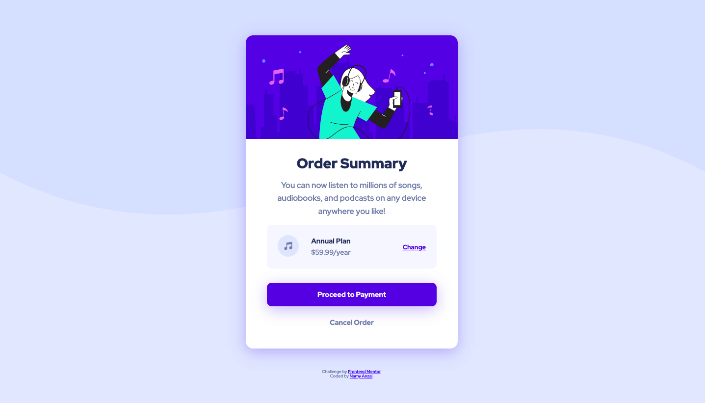

# Frontend Mentor - Order summary card solution

This is a solution to the [Order summary card challenge on Frontend Mentor](https://www.frontendmentor.io/challenges/order-summary-component-QlPmajDUj). Frontend Mentor challenges help you improve your coding skills by building realistic projects. 

## Overview

### The challenge

Users should be able to:

- See hover states for interactive elements

### Screenshot

### Links

- Solution URL: [Add solution URL here](https://www.frontendmentor.io/solutions/order-summary-component-using-html5-and-css-SyCdqkzV9)
- Live Site URL: [Add live site URL here](https://namy160.github.io/order-summary-component-frontend_mentor_challenge/)

## My process

### Built with

- Semantic HTML5 markup
- CSS custom properties
- Flexbox

### What I learned

- Implementing Box-Shaddow
- Hoverable Buttons

## Author

- Frontend Mentor - [@namy160](https://www.frontendmentor.io/profile/namy160)
